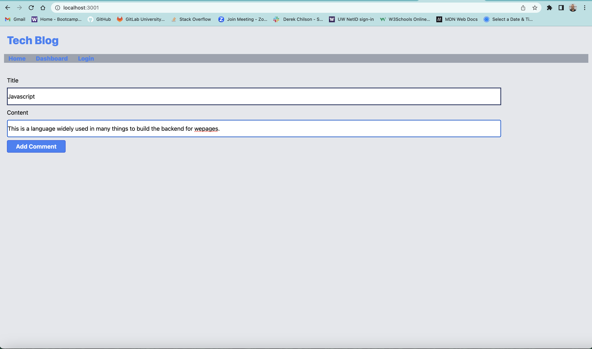
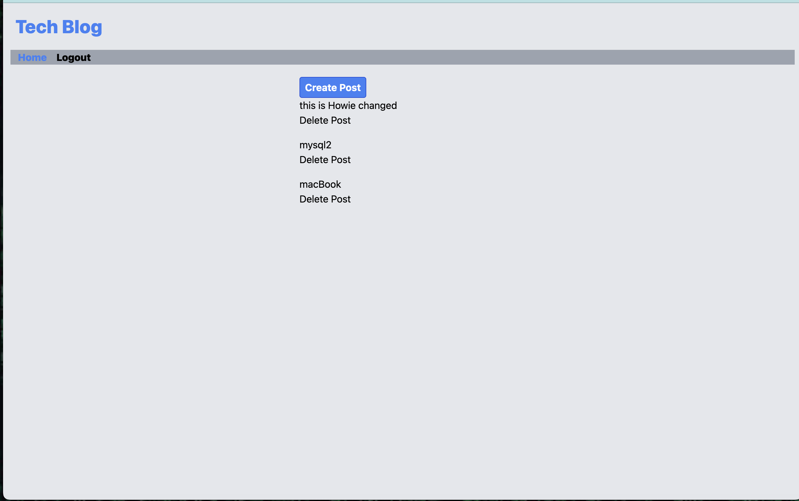

# my-mvc

## Description
This is a blog for tech users that want to share information on what technology they know. It is set up to post comments with titles and users. Once you login or sign-up you can add new posts to the site.

## Installation

If you open the code on VScode or a IDE of your choice. Open the integrated terminal and type "npm i", then sign into SQL and run your source schema. Don't forget to change the .env file or add one. Once you've done this you can either type nodemon or node index.js to start the program. Go to a browser and at the https area type in localhost:3001 then you will be brought to the page.

## Usage
If the page is up and running you can either login or sign-up and create an account. If you want to create a new post you can add a title and some content. Once your done you can go to the homepage and either update your post or delete it.

## Credits
I used insomnia to get the routes working, Tutor Andres helped me get some of the routes set up right.

